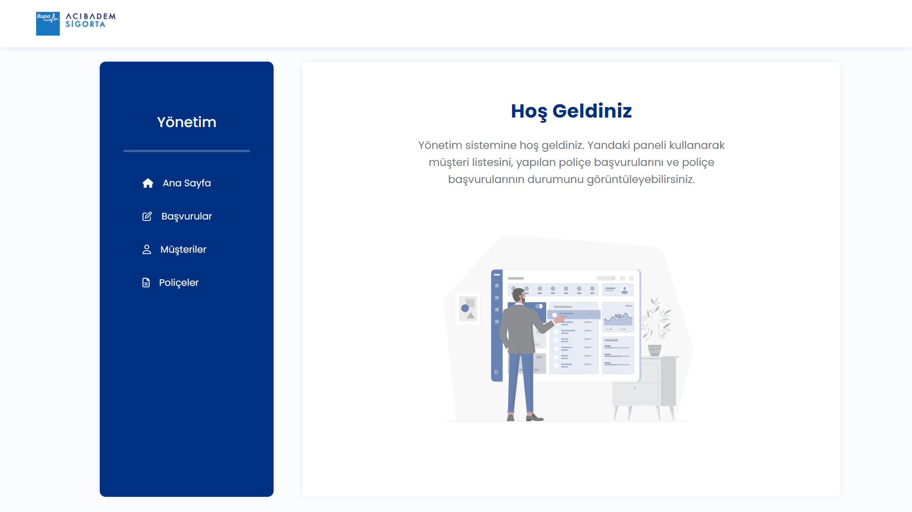

# 🚑 Health Insurance System 🏥

## About Project

This repository contains the graduation project of [Patika.dev](https://patika.dev) & [Bupa Acıbadem Sigorta](https://www.bupaacibadem.com.tr/) Full Stack Bootcamp. A health insurance system was designed in this project and this system has two sections: customer register system and administration system. N-Tier architecture and REST API was used to design server side of this project and Angular was used for client side.

#### Customer Register System

- In customer register system, **inpatient treatment**, **ambulatory treatment** and **ambulatory + inpatient treatment** policy options are available and **pre-payment**, **3 or 6 installments** options are available as payment methods. Register system can be reached by typing `localhost:{your-port-number}/satinal`. (e.g. `localhost:4200/satinal`)
- In the first step, the customer who wants to buy a health policy, types their personal information such as national identity number, name, surname, gender etc. 
- In second step the customer chooses the policy option and payment metod they want.
- In third and the last step the customer types their credit card information and completes their register process.

#### Administration System

- In this project there is no authentication or login system for administation panel. Administation system's home page can be reached by typing `localhost:{your-port-number}/mudurluk`. (e.g. `localhost:4200/mudurluk`)
- Admin can display customer list, policy applications and application statuses in the administration system.

## Screenshots

### Customer Screen

### Administration Screen

## Used Technologies

## Contact Me

**Özge Demiryol**

 

If you have any recommendation about project or noticed any error/bug, please give me feedback. 

